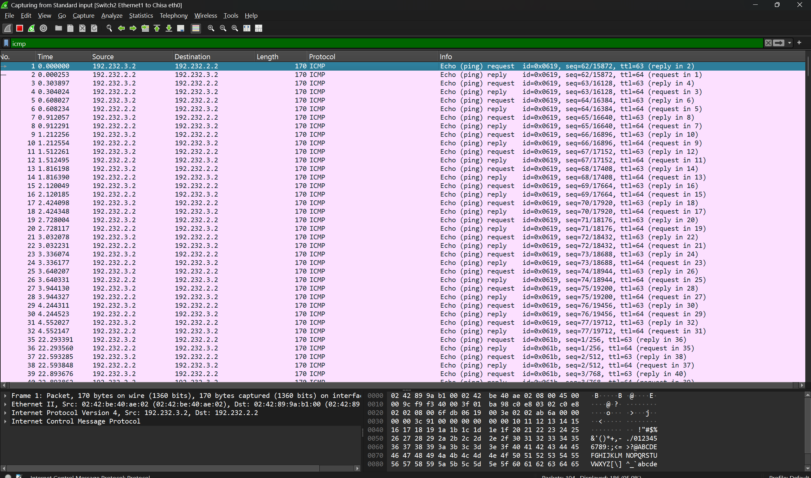
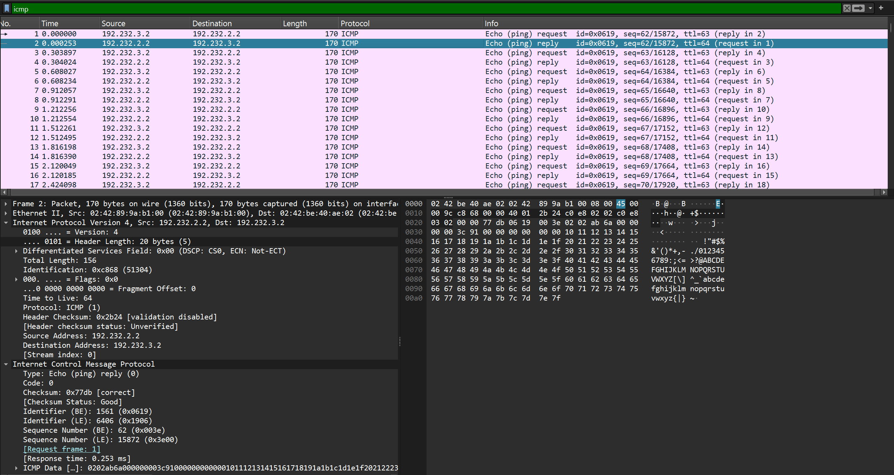
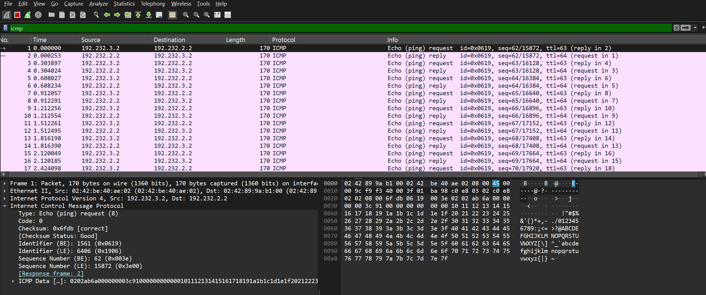

# Langkah-Langkah

## Pengujian Ketahanan Koneksi
Buka aplikasi Wireshark melalui GNS3 untuk jaringan Chisa. Jika sudah terbuka, lanjut masuk ke dalam container Knights dan kirimkan paket ping sebanyak 77 kali. 
```bash
ping -c 77 -s 128 -i 0.3 192.232.2.2
```

Jika berhasil, maka akan seperti ini hasilnya:


## Data Yang Didapat
Dari scan tersebut, di dapat nilai ICMP Type dan Code untuk Echo Request dan Echo Reply adalah sebagai berikut:
| | Echo | Code |
|---|---|---|
| Request | 8 | 0 |
| Reply | 0 | 0 |



