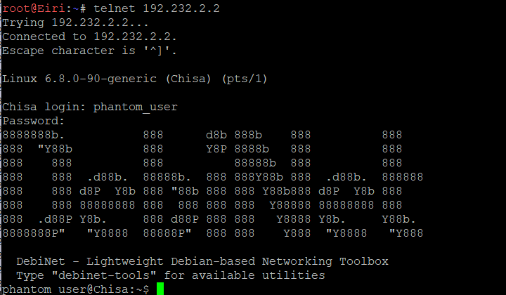
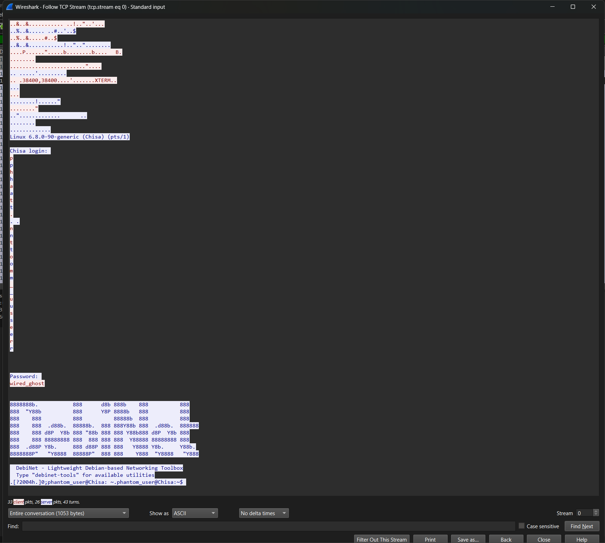

Pertama perlu membuat akun Phantom User di Chisa, maka masuk ke dalam terminal Chisa dan lakukan:
```
useradd -m -s /bin/bash phantom_user
echo "phantom_user:wired_ghost" | chpasswd
```

Untuk verifikasi apakah user tersebut berhasil terbuat, lakukan
```
id phantom_user
```

Jika sudah, jalankan protokol Telnet
```
service inetutils-inetd start
```

Untuk mengecek apakah sudah berjalan bisa dengan
```
ss -tulpn | grep 23
```

Lalu, di terminal Eiri jalankan
```
telnet 192.232.2.2
```

Dan login menggunakan username ```phantom_user``` dan password ```wired_ghost```
Jika sudah login, akan terlihat seperti ini


Lalu analisis wiresharknya dengan capture kabel Chisa (port 23) dan klik kanan pada paket Telnet lalu pilih follow > TCP stream, hasilnya akan terlihat seperti ini

Dapat terlihat kelemahan dari protokol Telnet dimana terlihat username dan password yang terlihat jelas dalam teks biasa, tanpa enkripsi.