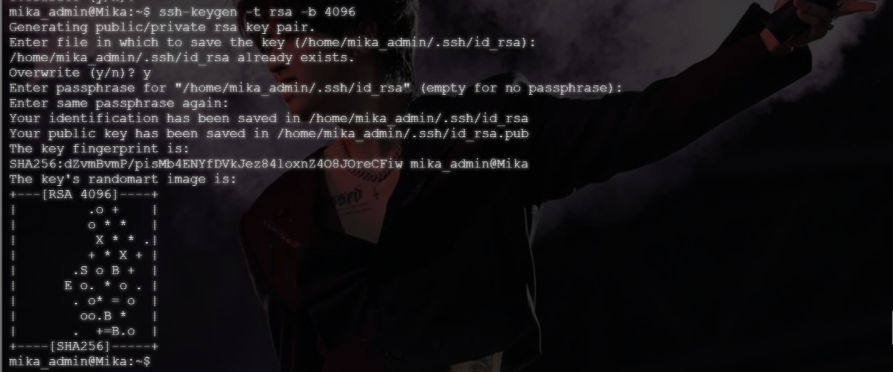
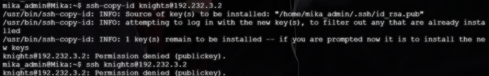
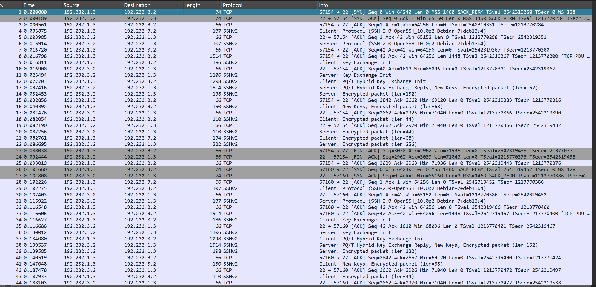
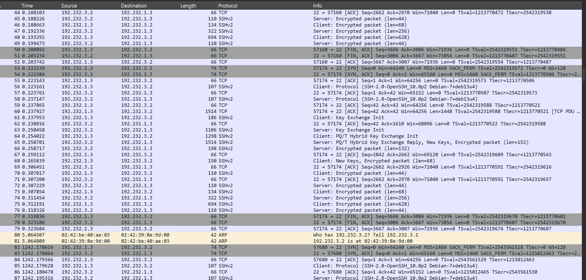
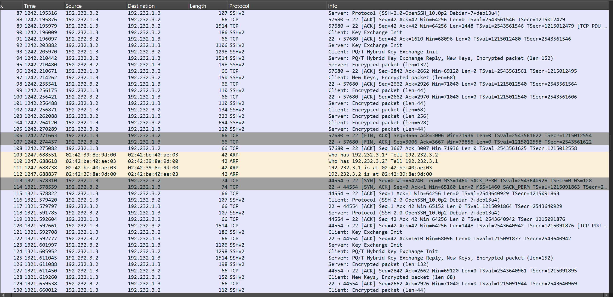
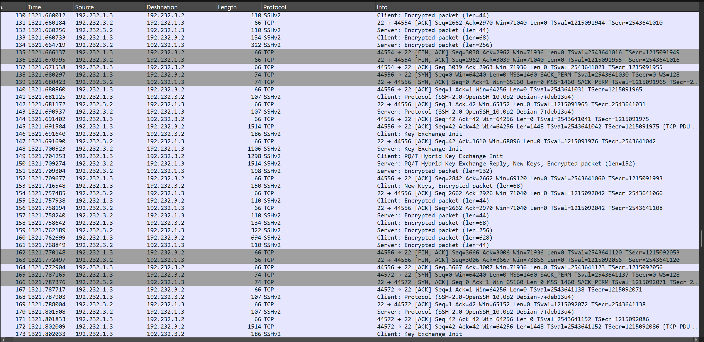
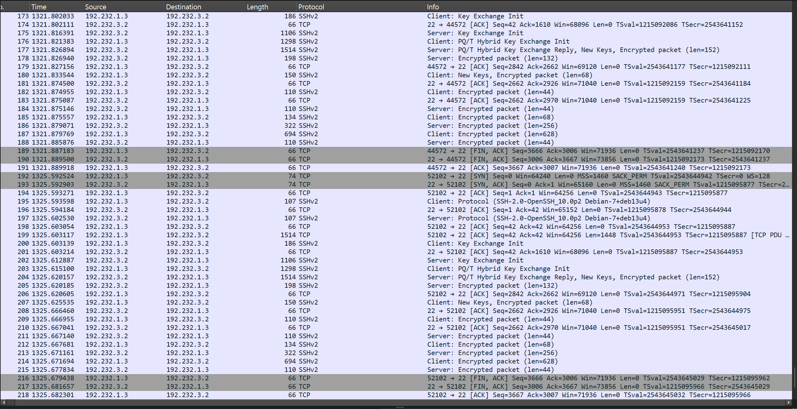
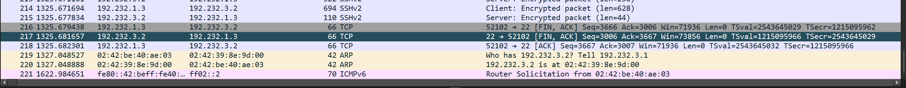

# Langkah - Langkah

## Instalasi OpenSSH
Masuk ke container Knights dan install OpenSSH. 
```bash
apt-get install openssh-server -y
```

Jika sudah, edit `/etc/ssh/ssh_config` dengan memastikan bahwa `PasswordAuthentication no` dan `PubkeyAuthentication yes`. 

## Lakukan Koneksi SSH
Masuk ke container Mika dan lakukan koneksi ke Knights.

```bash
su - mika_admin #Masuk sebagai admin terlebih dulu
```

Kemudian buat pasangan kunci SSH di container Mika. 
```bash
ssh-keygen -t rsa -b 4096
```



Setelah ini lakukan konseksi ke container Knights. 
```bash
ssh-copy-id knights@192.232.3.2 #Salin terlebih dulu IP Address-nya
ssh knights@192.232.3.2 
```

Hasil dari perintah ini adalah *permission denied*. Hal ini terjadi karena pada konfigurasi *publiic key* di container Knights adalah `PasswordAuthentication no`. 



## Data yang Diperoleh








Dari hasil scan Wireshark diatas, dapat dilihat di baris 4, cliient menginformasikan versi protokol SSH yang digunakan dengan `Cluent: Protocol (SSH-2.0.....)`, kemudian di baris 5 Server membalas dengan identitas versinya. 

Kemudian pada bagian Key Exchange (Di baris ke 9-12), terjadi proses pertukaran parameter kriptografi dan negosiasi algoritma keamanan. Di tahap ini kedua belah pihak membuat kunci enkripsi sementara yang unik.

Dan yang terakhir, setelah proses pertukaran kunci selesai, seluruh paket berikutnya menjadi `Encrypted packed (len=.....)`. Ini terjadi karena SSH mengenkripsi seluruh isi data sehingga kredensial tidak terlihat. 