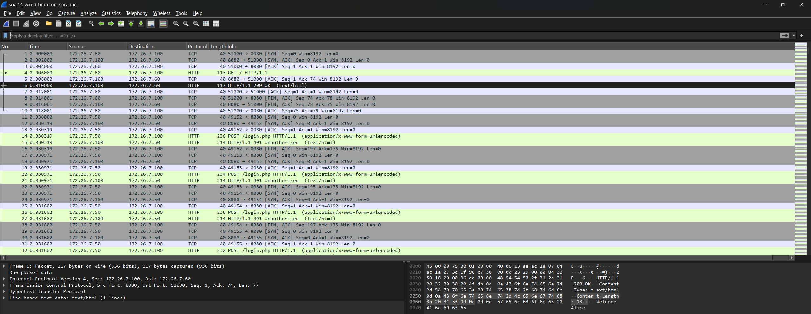
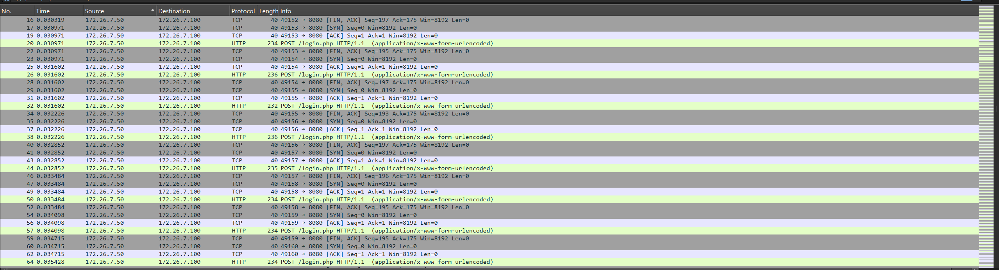
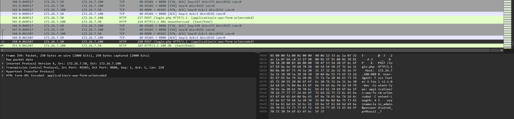
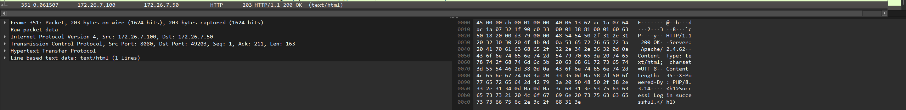
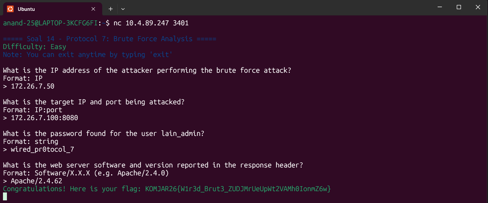

Pertama untuk melakukan analisis kita download dan buka file bruteforce di dalam wireshark,


Dari file ini dapat terlihat jejak serangan dari Eiri kepada form login web Alice yang dilakukan berulang-ulang kali dan akhirnya dia mendapatkan kredensial loginnya secara brute force.

Untuk mendapatkan IP dari penyerang, kita analisis dan sortir pola serangannya dengan cara klik sourcenya supaya tersusun secara descending, disini terlihat bahwa IP 172.26.7.50 adalah IP yang paling sering muncul dan terkoneksi dalam rentang waktu yang sangat singkat, yang memberikan ciri khas serangan brute force otomatis dengan menggunakan script/tool.


Dan dari gambar yang sama, kita juga dapat determinasi apa IP target dan portnya, yaitu ```172.26.7.100:8080```.

Dan dari brute force ini, scriptnya memasuki banyak sekali password untuk mencoba memasuki ke dalam akunnya, dan pada akhirnya dapatlah password akunnya dan memasuki akun tersebut, ini dapat terlihat di dalam wiresharknya pada akhir-akhir log capturenya.


Dengan memilih frame ke-350, kita bisa lihat di kanan bawah apa password yang dimiliki oleh akun Alice, yaitu ```wired_pr0tocol_7```

Dan terakhir, untuk mendapatkan web server software yang terdapat pada response header, kita cukup pilih frame ke-351 yang terlihat di text kanan bawah.

Dari sini, terlihat bahwa web server software yang digunakan adalah Apache/2.4.62

Untuk memvalidasi penemuan kita, jalankan
```
nc 10.4.89.247 3401
```

Setelah ngerun di ubuntu, kita diberi mini quiz analisisnya, kita masuki penemuan kita satu per satu untuk validasi bahwa penemuan kita adalah benar.


Setelah semua hasil penemuan benar, flag yang didapatkan adalah
```
KOMJAR26{W1r3d_Brut3_ZUDJMrUeUpWt2VAMh0IonmZ6w}
```