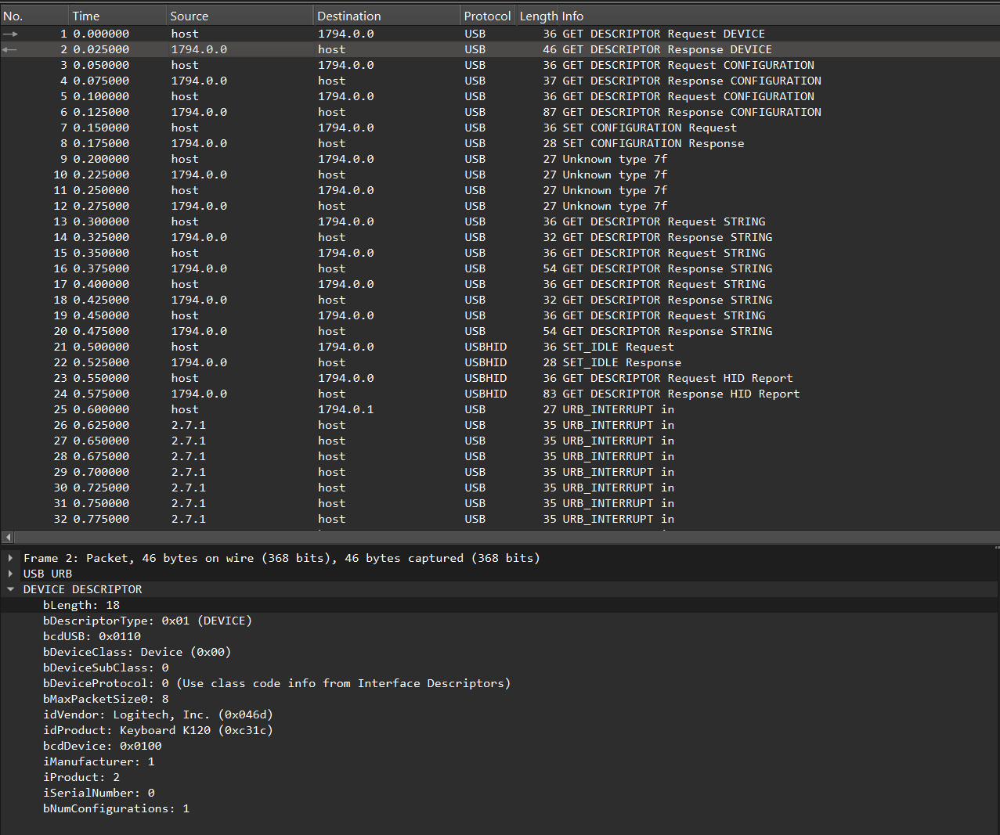
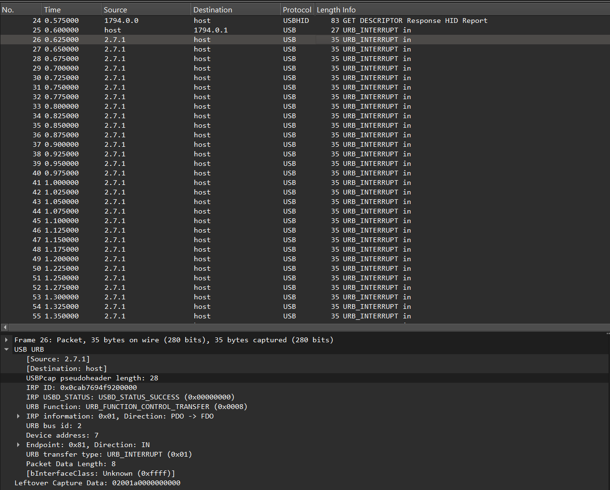
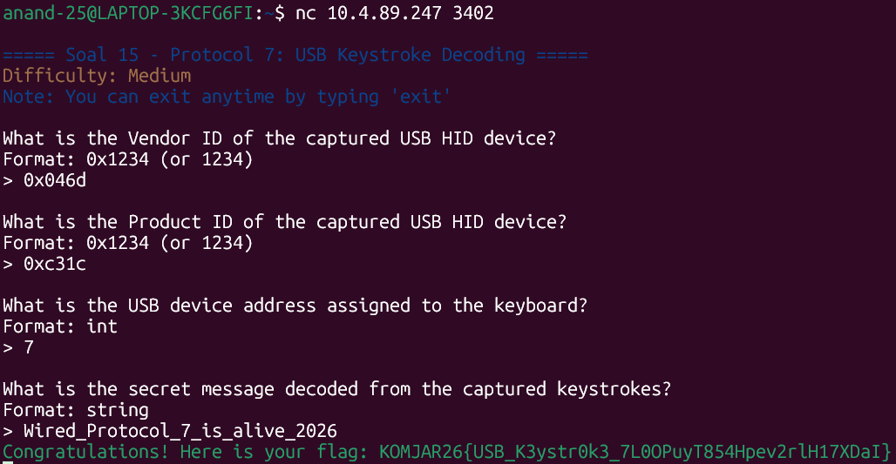

Pertama kita buka dulu file wired_usb_hidnya, disini bisa liat capture dari pemasangan USB berbahaya pada node Alice.

Pada frame ke-2, kita bisa dapatkan ID vendor dan ID productnya yang dapat terlihat pada gambar berikut.


ID Vendor = 0x046d
ID Product = 0xc31c

Untuk mencari adress dari USB device yang nyambung ke keyboard, dapat dilihat pada frame 26-85. Pada USB URBnya, terlihat bahwa device addressnya adalah ```7```.


Dan juga pada gambar yang sama dan frame yang sama, yaitu frame 26 dan frame genap setelahnya (28, 30, 32, dst) terdapat juga leftover capture data yang merupakan HID keyboard report 8-byte standar. Jika kita dekripsikan, kita akan dapat:
|Frame|Hex|Modifier|Keycode|Karakter|
|---|---|---|---|---|
|26-34|...|...|...|Wired|
|36|02002d|Shift|0x2d|_|
|38-52|...|...|...|Protocol|
|54|02002d|Shift|0x2d|_|
|56|000024|...|0x24|7|
|58|02002d|Shift|0x2d|_|
|60-62|...|...|...|is|
|64|02002d|Shift|0x2d|_|
|66-74|...|...|...|alive|
|76|02002d|Shift|0x2d|_|
|78-84|...|...|...|2026|

Jika digabung menjadi ```Wired_Protocol_7_is_alive_2026```

Untuk memvalidasi penemuan, maka kita jalankan
```
nc 10.4.89.247 3402
```


Dan setelah memasuki penemuan kita, dapatlah flagnya
```
KOMJAR26{USB_K3ystr0k3_7L0OPuyT854Hpev2rlH17XDaI}
```