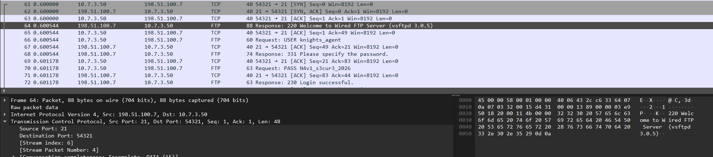
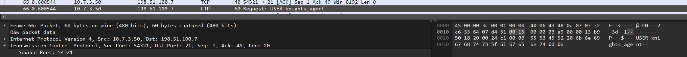
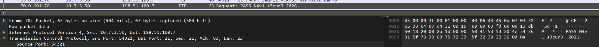
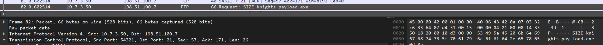
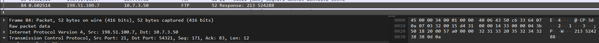
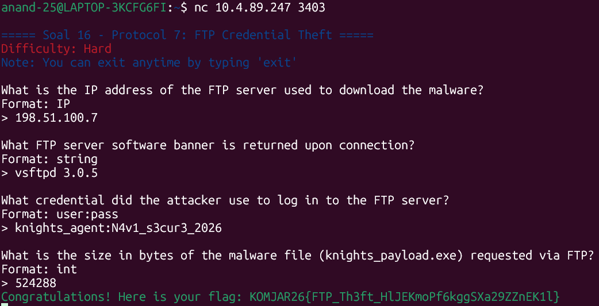

Untuk memulai analisis, buka dulu file wired_ftp_theft bekas serangan file malwarenya Eiri di wireshark.

Untuk mencari IP penyerang, kita perlu menyaring dulu samaran serangan dari Alice dikarenakan ia menjalankan beberapa sesi FTP secara sekaligus. Dan akhirnya, pada frame ke-64 ditemukan ip penyerang, yaitu ```198.51.100.7``` dikarenakan kita bisa melihat banner yang dikirim server saat koneksi pertama kali dibuka.


Dari gambar yang sama, kita juga bisa temukan apa server software FTP yang digunakan dari banner yang dikirim server, yaitu ```vsftpd 3.0.5```

Selanjutnya kita perlu mencari kredensial login penyerang yang dapat ditemukan pada frame 66 dan 70 yang berisi username dan passwordnya.



Didapat kredensial loginnya, yaitu ```knights_agent:N4v1_s3cur3_2026``` (user:pw). Login ini berhasil, ditandai dengan response `230 Login successful.` tepat setelahnya (frame 72).

Dan terakhir untuk ukuran dari file malware knights_payload.exe, terdapat pada frame ke-82 dan 84



Disini terlihat persis frame kapan filenya dikirim dan diikuti dengan ukurannya, yaitu ```524288```.

Berikut kita validasi penemuan kita dengan menjalankan
```
nc 10.4.89.247 3403
```


Setelah kita validasi hasil penemuan kita, dapatlah flagnya.
```
KOMJAR26{FTP_Th3ft_HlJEKmoPf6kggSXa29ZZnEK1l}
```