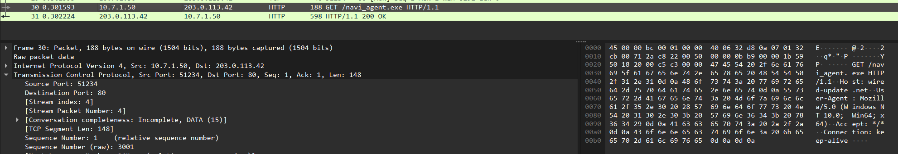
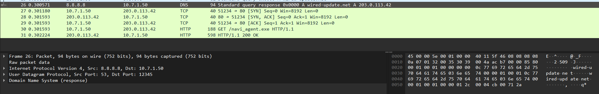
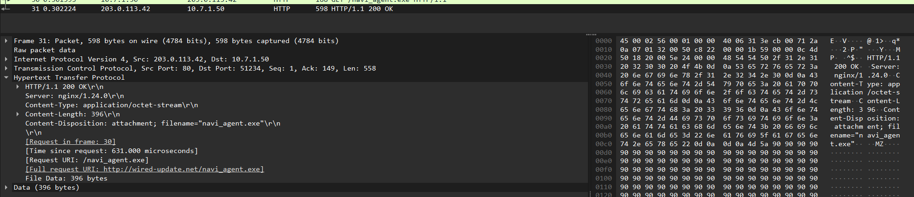
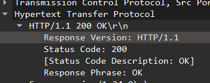
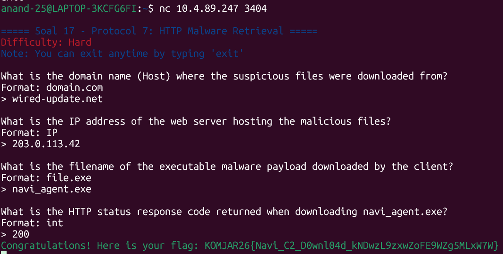

Pertama kita buka dulu file wired_http_c2 untuk memulai analisis kita. Selanjutnya kita diminta untuk mencari nama domain tempat malware tersebut diunduh.

Setelah di skimming, frame yang terdapat nama domain tempat malware tersebut diunduh adalah frame ke-30


Dari sini, kita bisa dapatkan nama domainnya adalah ```wired-update.net```.

Setelah itu kita diperlukan untuk mencari ip server penyerang yang dapat terlihat pada frame ke-30 tadi dan frame 25-26


IP dapat terlihat dari:
DNS Query:  wired-update.net > 203.0.113.42   (frame 25-26)
HTTP GET dikirim ke:  203.0.113.42            (frame 30)

Dan berikut kita mencari nama file malware yang diunduh, untuk mencarinya kita bisa lihat dari content-disposition dari frame 31:


Dari sini dapat terlihat bahwa nama file malwarenya adalah ```navi_agent.exe```

Dan terakhir kita diperlukan untuk mencari kode status HTTP yang dikembalikan yang dapat dilihat dari frame 31 lagi,


Dari sini terlihat bahwa status code yang dikirim adalah ```200```

Untuk memverifikasi hasil penemuan kita, jalankan
```
nc 10.4.89.247 3404
```


Setelah kita validasi penemuan kita, dapatlah flagnya
```
KOMJAR26{Navi_C2_D0wnl04d_kNDwzL9zxwZoFE9WZg5MLxW7W}
```