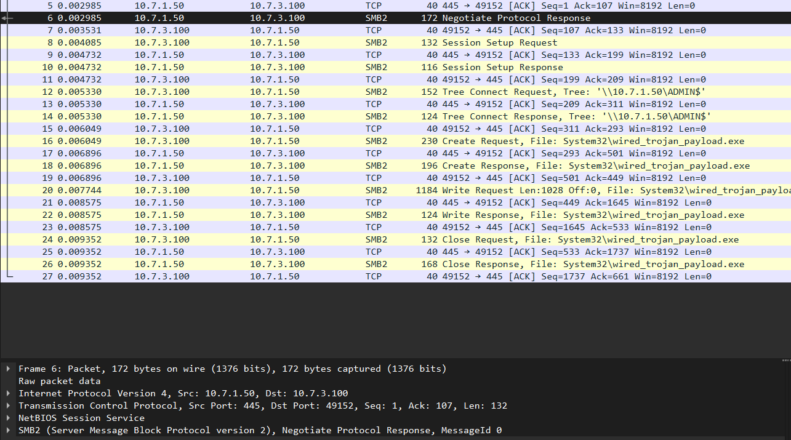
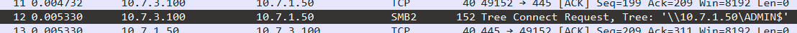
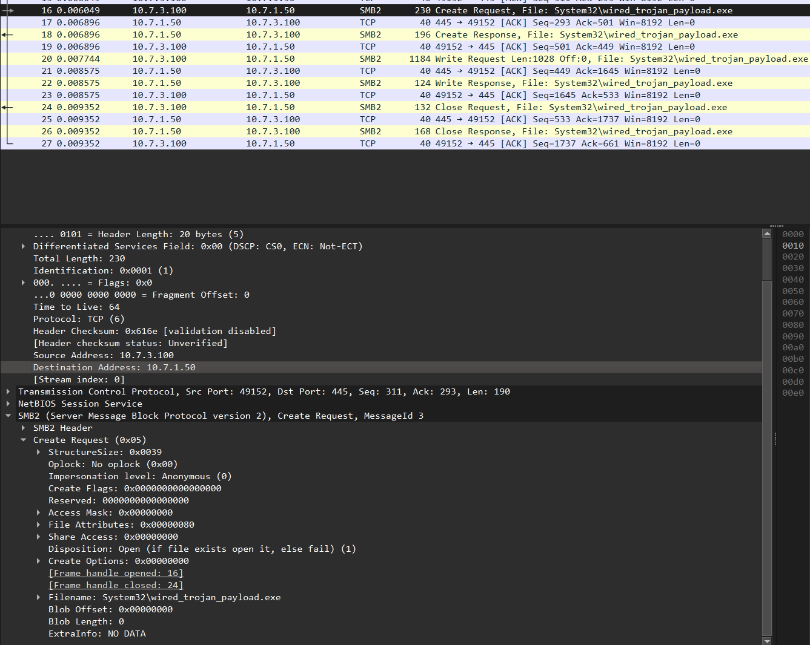
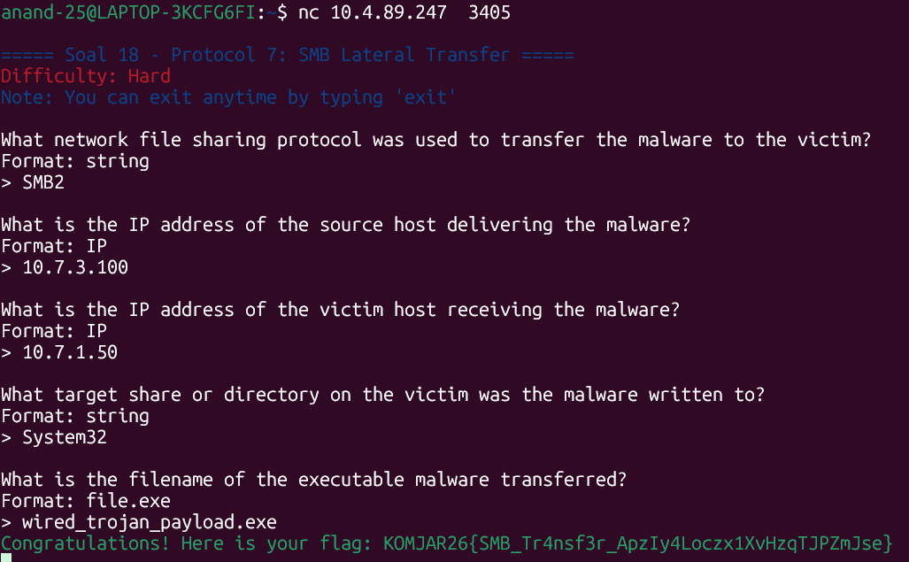

Pertama bukalah file wired_smb_transfer terlebih dahulu di wireshark.
Lalu, kita disuruh untuk mengidentifikasi nama protokol jaringan yang dieksploitasi. Untuk mencari namanya, kita bisa liat dari protocol hierarchy dan seluruh command yang dipakai (Negotiate Protocol, Session Setup, Tree Connect, Create, Write, Close) yang berada pada frame 4,6,8, dan seterusnya pada setiap angka genap.


Berikut, kita disuruh untuk mencari IP pengirim dan penerima. Untuk mencarinya, kita perlu melihat frame 12 pada bagian tree connect request yang membuka koneksi ke share ADMIN$ milik korban.


Dari frame ini, kita bisa melihat IP penyerangnya, yaitu ```10.7.3.100``` dan IP victim, yaitu ```10.7.1.50```.

Selanjutnya, kita perlu mencari folder tujuan penyimpanan malware pada sistem korban. Untuk mencarinya kita memasuki frame 16 dimana pada create request di dalam SMB2, kita bisa melihat berikut


Pada defaultnya, Windows memetakan file ke C:\Windows dan terlihat folder tujuannya pada Filenamenya, yaitu System32. Maka folder tujuannya adalah
```C:\Windows\System32```

Terakhir, kita disuruh mencari nama file executable malware yang ditransfer yang dapat dilihat dari gambar frame 16 tadi. Nama filenya adalah ```wired_trojan_payload.exe```

Untuk memverifikasi hasil penemuan kita, jalankan
```
nc 10.4.89.247  3405
```


Setelah kita validasi penemuan kita, dapatlah flagnya
```
KOMJAR26{SMB_Tr4nsf3r_ApzIy4Loczx1XvHzqTJPZmJse}
```