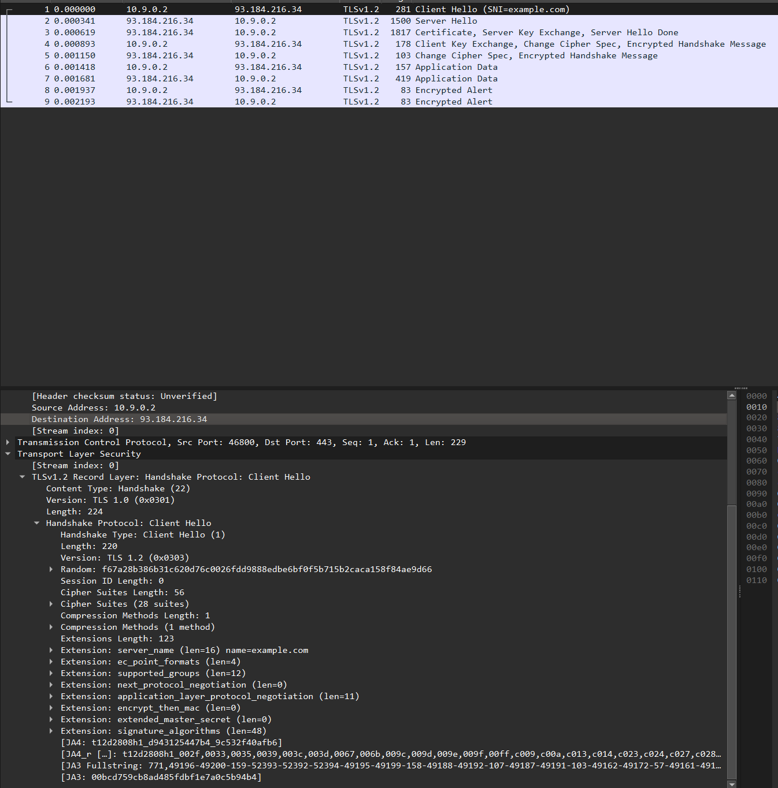
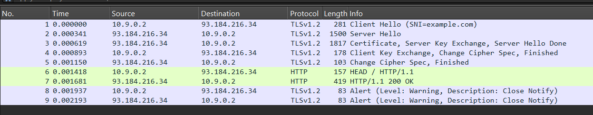
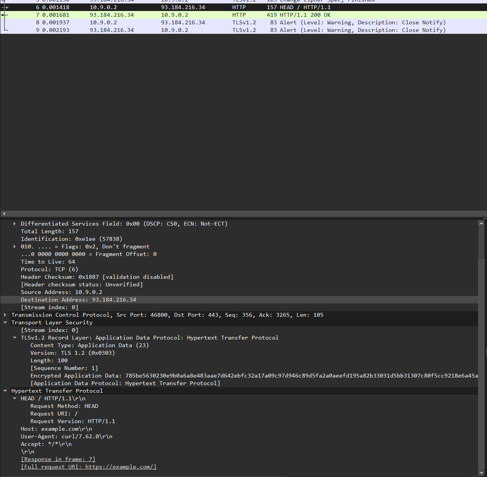
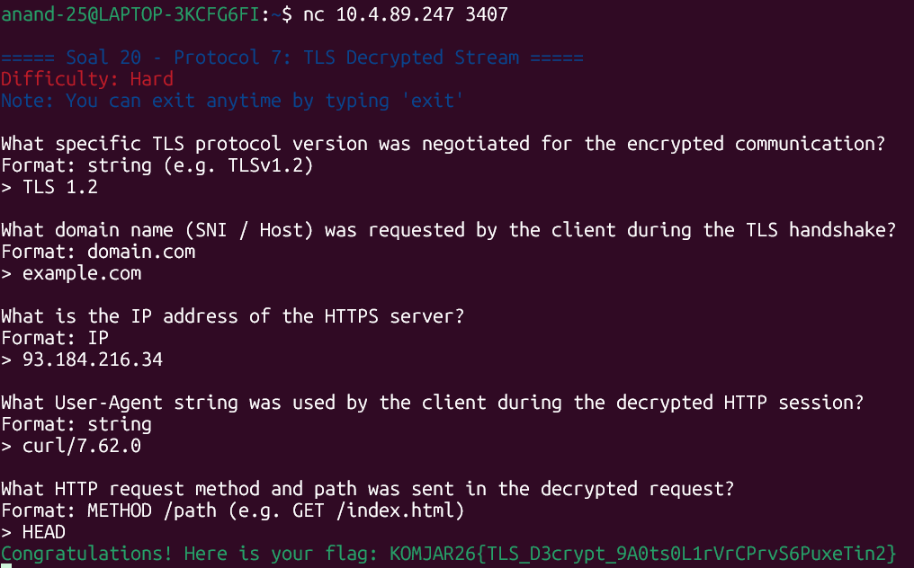

Pertama kita download dan extract all zip dari soalnya, lalu kita buka file tls_decrypt di wireshark.
Setelah itu, kita perlu untuk mengidentifikasi versi protokol TLS yang dinegosiasikan. Untuk mencarinya, kita masuk ke frame 1 dan pada bagian transport layer security (tsl), kita bisa melihat versi yang digunakan untuk protokol negosiasi (handshake protocol: client hello). Versi yang digunakan untuk protokol negosiasi tersebut adalah ```TLS 1.2```.


Berikut, kita perlu untuk mencari nama domain (SNI) yang diakses. Untuk mencarinya kita dapat melihat kembali gambar frame 1 dimana kita bisa melihat nama domain SNI yang digunakan pada info dari frame 1. Info dari frame 1 yaitu Client Hello ```(SNI=example.com)```

Selanjutnya, kita disuruh untuk mencari alamat IP server HTTPS penyerang. Kita bisa melihat IP server HTTPS penyerang dengan melihat kembali ke frame 1, dimana IP penyerangnya adalah 10.9.0.2 dan IP servernya adalah ```93.184.216.34```.

Step selanjutnya adalah pencarian User-Agent yang digunakan. Untuk mencarinya, kita pertama perlu pergi ke Edit > Preferences > Protocols > TLS pada file tls_decrypt di wireshark tadi. Lalu di kolom (Pre)-Master-Secret log filename, klik Browse dan pilih file keyslogfile.txt. Setelah itu klik OK.


Setelah klik OK, akan muncul frame 6 dan 7 yang baru (67!!!) dikarenakan file sudah di dekripsi dengan menggunakan keyslogfile.txt. Baru sekarang kita bisa mencari User-Agent yang digunakan. Untuk mencarinya, kita memasuki frame 6 dan lihat pada bagian hypertext transfer protocol. Disitu terdapat User-Agent yang kita cari, yaitu ```curl/7.62.0```.


Dan terakhir, kita disuruh untuk mencari HTTP request method dan path yang tersembunyi di dalam sesi dekripsi. Dari foto frame 6 sebelumnya, kita bisa melihat bahwa request method dan path yang tersembunyi terdapat
```
HEAD / HTTP/1.1
Host: example.com
User-Agent: curl/7.62.0
Accept: */*
```

Dan untuk mendapatkan request method yang digunakan untuk mendapatkan HTTP, kita lihat pada line pertama terdapat HEAD / HTTP/1.1, yang dimaksud dari HEAD adalah metode request dan path yang tersembunyi di dalam sesi deskripsinya. Maka metode dan path yang digunakan adalah ```HEAD```.

Untuk memverifikasi hasil penemuan kita, jalankan
```
nc 10.4.89.247 3407
```


Setelah kita validasi penemuan kita, dapatlah flagnya
```
KOMJAR26{TLS_D3crypt_9A0ts0L1rVrCPrvS6PuxeTin2}
```