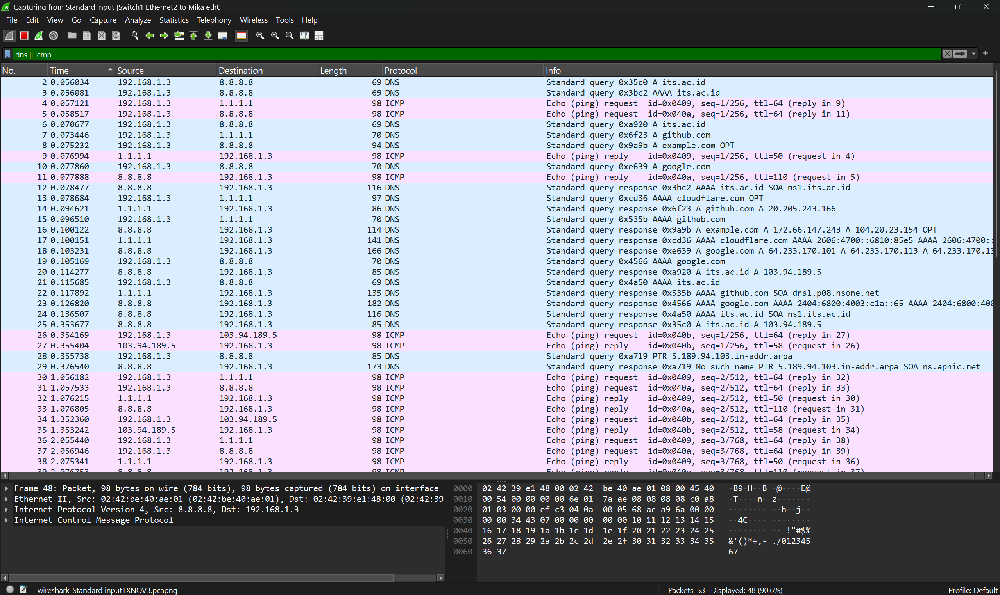
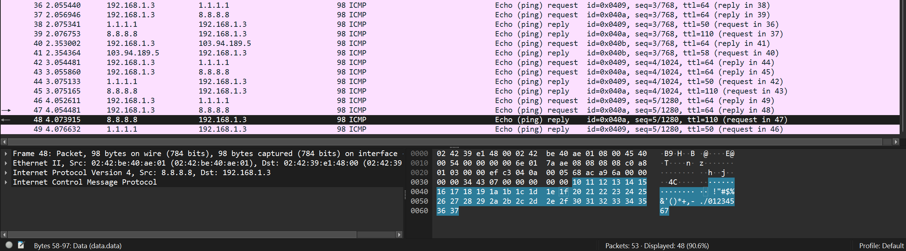

# Langkah-Langkah

Masuk ke root@Mika
Masukin file yang dikasih buat traffic protocol
chmod +x, kemudian jalankan

// Karna error, buka terminal baru, masuk ke root@Lain
Jalankan:
1. Pastikan IP forwarding aktif
sysctl -w net.ipv4.ip_forward=1

2. Reset dan pasang ulang aturan NAT MASQUERADE secara umum
iptables -t nat -F
iptables -t nat -A POSTROUTING -o eth0 -j MASQUERADE

3. Pastikan policy FORWARD di accept
iptables -P FORWARD ACCEPT

Sekarang buka aplikasi GNS3 (HARUS APLIKASI)
Klik kanan di link yang menghubungkan Mika dan Switch 1. 
Pilih Start Capture

Kemudian setelah Wireshark terbuka, kembali ke terminal Mika
Jalankan: ./traffic_protocol7.sh
Screenshots hasil:

