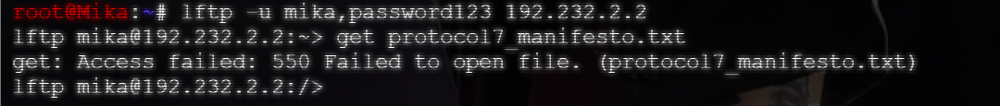

# Langkah-Langkah

## Down file 
Down file protocol7_manifesto.txt ke container Chisa. 

Masuk ke container Mika, login ke akun Chisa menggunakan FTP atau lftp.
```bash
lftp - u mika,password123 192.232.2.2
``` 
Catatan: 
- Sesuaikan password dengan yang telah di tentukan sebelumnya. 

`192.232.2.2` merupakan IP address dari Chisa. Nanti kalau sudah berhasil masuk, jalankan perintah:
```bash
get protocol7_manifesto.txt
```

Hasil:



### Note!
Kalau semisal tidak bisa, coba jalankan:
```bash
mkdir -p /home/mika
echo "Ini adalah dokumen protokol 7" > /home/mika/protocol7_manifesto.txt
chown -R mika:mika /home/mika
chmod 644 /home/mika/protocol7_manifesto.txt

#Ini berfungsi untuk mememastikan file ada di direktorinya. 

## Untuk bagian `echo`, bisa di isi kosong saja. 
```

Sebelum menjalankan kembali `lftp -u mika,password123 192.232.2.2`, pastikan vsftpd berjalan di container Chisa. 

Check dengan `ss -tulpn | grep vsftpd`. Pastikan berjalan di port 21.