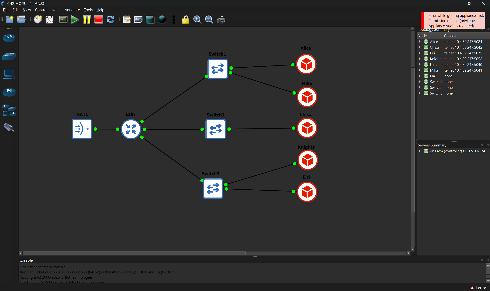
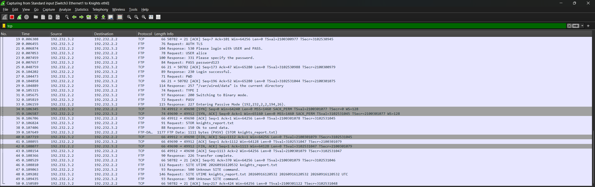
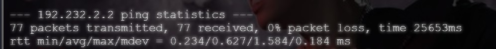
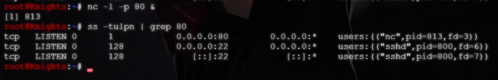
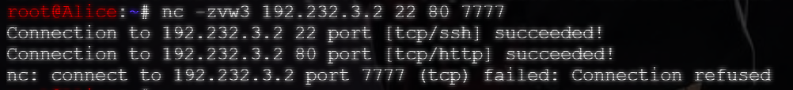
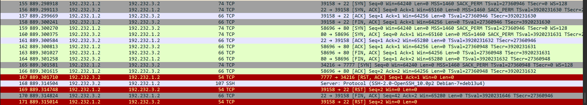
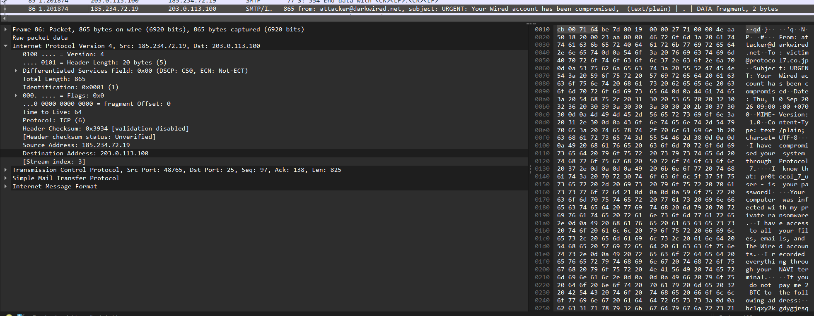
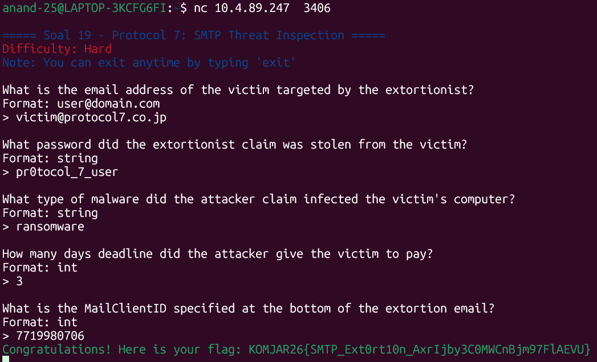

# Jarkom-Modul-1-2026-K-42

## Anggota Kelompok
| Nama | NRP | Pembagian Soal |
|---|---|---|
| Azita Zahwa Zahida Asmoro | 5027251058 | 1-7, 9-10, 12-13 |
| I Made Gyanendra Anand Wisnawa | 5027251072 | 8, 11, 13-20 | 


## SOAL 1 - 3
Untuk menyelesaikan soal ini, masuk ke GNS dan buatlah struktur jaringan sesuai dengan yang telah di instruksikan. 

Apabila sudah sesuai, konfigurasikan Lain agar dapat terhubung dengan NAT pada eth0. 
```bash

# Masuk ke file dengan command
nano /etc/network/interfaces

# Isi file dengan:
auto lo
iface lo inet loopback

auto eth0
iface eth0 inet dhcp

# eth1 ke Switch 1 (Alice & Mika)
auto eth1
iface eth1 inet static
    address 192.168.1.1
    netmask 255.255.255.0

# eth2 ke Switch 2 (Chisa)
auto eth2
iface eth2 inet static
    address 192.168.2.1
    netmask 255.255.255.0

# eth3 ke Switch 3 (Knights & Eiri)
auto eth3
iface eth3 inet static
    address 192.168.3.1
    netmask 255.255.255.0
```

## SOAL 4
Sebelum melakukan pengerjaan Soal 4, masuk ke kontainer (komputer) Alice dengan menjalankan *command* `telnet 10.4.89.247 5060`.

Kemudian nyalakan interface eth0, IP Statis, default gateaway, dan set DNS Google.
Kalo udah, nyalain interface eth0
```bash
ip link set dev eth0 up
ip addr add 192.168.1.2/24 dev eth0
ip route add default via 192.168.1.1 dev eth0
echo "nameserver 8.8.8.8" > /etc/resolv.conf
```

Kemudian lakukan hal serupa pada kontainer (komputer) Lainnya.

Chisa: 
```bash 
telnet 10.4.89.247 5062
ip link set dev eth0 up
ip addr add 192.168.2.2/24 dev eth0
ip route add default via 192.168.2.1 dev eth0
echo "nameserver 8.8.8.8" > /etc/resolv.conf
```

Eiri:
```bash 
telnet 10.4.89.247 5075
ip link set dev eth0 up
ip addr add 192.168.3.3/24 dev eth0
ip route add default via 192.168.3.1 dev eth0
echo "nameserver 8.8.8.8" > /etc/resolv.conf
```

Knights:
```bash
telnet 10.4.89.247 5063
ip link set dev eth0 up
ip addr add 192.168.3.2/24 dev eth0
ip route add default via 192.168.3.1 dev eth0
echo "nameserver 8.8.8.8" > /etc/resolv.conf
```

Mika
```bash
auto eth0
iface eth0 inet static
        address 192.232.1.3
        netmask 255.255.255.0
        gateway 192.232.1.1
        up echo nameserver 192.232.1.1 > /etc/resolv.conf
```

```bash
telnet 10.4.89.247 5061
ip link set dev eth0 up
ip addr add 192.168.1.3/24 dev eth0
ip route add default via 192.168.1.1 dev eth0
echo "nameserver 8.8.8.8" > /etc/resolv.conf
```

Kemudian jalankan ini juga di root@Lain untuk nyalain interface
```bash
ip link set dev eth0 up
ip link set dev eth1 up
ip link set dev eth2 up
ip link set dev eth3 up

# Jalankan "ip-br a" untuk melakukan pengecekan
# Lanjutkan dengan memasang IP Statisnya
ip addr add 192.168.1.1/24 dev eth1
ip addr add 192.168.2.1/24 dev eth2
ip addr add 192.168.3.1/24 dev eth3
```

Jika semua sudah di-set, buktikan dengan melakukan ping.
```bash
ping -c 2 8.8.8.8
ping -c 2 google.com
ping -c 2 <masing-masing IP Container>
```

## SOAL 5
Untuk menjalankan nomor 5, masuk ke kontainer (komputer) Lain kemudian jalankan *command* berikut: 
```bash
cat << 'EOF' > /root/cek_status.sh
#!/bin/bash

echo "DEBINET ROUTER 'LAIN' - STATUS CHECK"
echo ""

echo "1. Memastikan IP Forwarding Aktif..."
sysctl -w net.ipv4.ip_forward=1
echo ""

echo "2. Mengaktifkan Kembali Aturan NAT (MASQUERADE)..."
iptables -t nat -A POSTROUTING -o eth0 -j MASQUERADE
echo ""

echo "3. Ringkasan Interface & IP (ip -br a):"
ip -br a
echo ""

echo "4. Status Tabel NAT (iptables -t nat -L -v -n):"
iptables -t nat -L -v -n
echo ""

echo "VERIFIKASI SELESAI & SIAP BEROPERASI"
EOF
```
Jika sudah, berikan akses eksekusi dan jalankan file `cek_status.sh`.
```bash 
chmod +x /root/cek_status.sh
/root/cek_status.sh
```

## SOAL 6
Untuk menjalankan soal nomor 6, masuk ke root@Mika. Kemudian buat sebuah file dengan nama `traffic_protocol7.sh`.
```bash
nano traffic_protocol7.sh
```
Kemudian pindahkan isi dari file yang telah diberikan ke dalam file yang telah dibuat, selanjutnya berikan akses eksekusi dan jalankan file tersebut.
```bash
chmod +x traffic_protocol7.sh
```
Buka Wireshark untuk melihat jaringan yang terkoneksi ke kontainer (komputer) Mika. Kemudian jalankan file dengan *command* `./traffic_protocol7.sh` dan pasang filter`dns || icmp`.


## SOAL 7
Untuk menjalankan soal nomor 7, masuk ke kontainer (komputer) Chisa dan instalasi user-user lainnya dengan menjalankan:
```bash
mkdir -p /var/wired/data

useradd -m -d /var/wired/data -s /usr/sbin/nologin alice
useradd -m -d /var/wired/data -s /usr/sbin/nologin mika
useradd -m -d /var/wired/data -s /usr/sbin/nologin eiri

# Kemudian berikan password kepada masing-masing user

echo "alice:alice" | chpasswd
echo "mika:mika" | chpasswd
echo "eiri:eiri" | chpasswd
```

Selanjutnya install vsdtpf di kontainer (komputer) Chisa dengan menjalankan:
```bash
cd ~
sudo apt update
sudo apt download vsftpd ssl-cert
```

Selanjutnya cek masing-masing dari user.
```bash
useradd -m -d /var/wired/data alice && passwd alice
useradd -m -d /var/wired/data mika && passwd mika
useradd -m -d /var/wired/data eiri && passwd eiri

# Apabila output menunjukkan bahwa "user sudah ada", maka lanjutkan tahap berikutnya.
```

Selanjutnya masukkan data user yang diblokir
```bash
echo "eiri" >> /etc/vsftpd.user_list
```

Masukkan konfigurasi vsftpd
```bash
cat << 'EOF' > /etc/vsftpd.conf
listen=YES
anonymous_enable=NO
local_enable=YES
write_enable=YES
local_umask=022
dirmessage_enable=YES
use_localtime=YES
connect_from_port_20=YES
chroot_local_user=YES
allow_writeable_chroot=YES
secure_chroot_dir=/var/run/vsftpd/empty
pam_service_name=vsftpd

# Konfigurasi Blacklist (Eiri)
userlist_enable=YES
userlist_file=/etc/vsftpd.user_list
userlist_deny=YES

# Konfigurasi Konfigurasi Per-User (Alice & Mika)
user_config_dir=/etc/vsftpd_user_conf
EOF
```

Kemudian masukkan konfigurasi untuk masing-masing akun (user).

```bash
mkdir -p /etc/vsftpd_user_conf
echo "write_enable=YES" > /etc/vsftpd_user_conf/alice
echo "write_enable=NO" > /etc/vsftpd_user_conf/mika
```

Jalanin vsftpd di background
```bash
mkdir -p /var/run/vsftpd/empty
vsftpd /etc/vsftpd.conf &
```

Bikin file sebagai Alice
```bash
# Berikan izin write pada Alice
chmod 777 /var/wired/data

su - alice -c "touch /var/wired/data/signal_alice.txt"
ls -l /var/wired/data/signal_alice.txt #Ini untuk verifikasi
```

## SOAL 8

Masuk ke root Knights, lalu buat file laporan ```knights_report.txt```

```bash
nano knights_report.txt
```

Lalu file knights_report.txt diisi dari file .txt yang terdapat dalam soal nomor 8 yang berisi:
```bash
==================================================
  KNIGHTS OF THE EASTERN CALCULUS — STATUS REPORT
  Protocol 7 Surveillance Network
  Classification: LEVEL 7 — EYES ONLY
==================================================

Date: [CLASSIFIED]
Agent: Knights Unit Alpha
Node: Switch 3 — Subnet 10.<PREFIX>.3.0/24

---

SUBJECT: Network Reconnaissance Report

The Wired has been successfully infiltrated through
Protocol 7 channels. Current observations:

1. Router "Lain" has been identified as the central
   gateway node connecting all three subnet segments.

2. Switch 1 (10.<PREFIX>.1.0/24) hosts Alice and Mika.
   Both nodes show standard traffic patterns.

3. Switch 2 (10.<PREFIX>.2.0/24) hosts Chisa alone.
   Isolated subnet — minimal cross-traffic observed.

4. Switch 3 (10.<PREFIX>.3.0/24) — our operational base.
   Knights and Eiri coexist on this segment.

RECOMMENDATION:
Continue monitoring FTP and Telnet sessions for
plaintext credential exposure. SSH tunnels remain
impenetrable without keylog access.

--- END OF REPORT ---
Knights of the Eastern Calculus
"Let's all love Lain."
```

Nyalakan layanan vsftp di Chisa sebelum step berikutnya
```bash
vsftpd /etc/vsftpd.conf &
```

Lalu hubungkan knights ke FTP server Chisa dan jalankan command uploadnya setelah masuk
```bash
lftp -u alice,password123 192.232.2.2
up knights_report.txt
```


Sudah terlihat perintah untuk STOR, kode status sukses server (226), dan port data TCP pada mode PASV

Verifikasi bahwa file sudah terupload
```bash
lftp -u alice,password123 192.232.2.2 #jalankan untuk masuk ke Alice
```
```
lftp alice@192.232.2.2:~> put knights_report.txt
1111 bytes transferred
lftp alice@192.232.2.2:~> cat knights_report.txt
==================================================
  KNIGHTS OF THE EASTERN CALCULUS — STATUS REPORT
  Protocol 7 Surveillance Network
  Classification: LEVEL 7 — EYES ONLY
==================================================

Date: [CLASSIFIED]
Agent: Knights Unit Alpha
Node: Switch 3 — Subnet 10.<PREFIX>.3.0/24

---

SUBJECT: Network Reconnaissance Report

The Wired has been successfully infiltrated through
Protocol 7 channels. Current observations:

1. Router "Lain" has been identified as the central
   gateway node connecting all three subnet segments.

2. Switch 1 (10.<PREFIX>.1.0/24) hosts Alice and Mika.
   Both nodes show standard traffic patterns.

3. Switch 2 (10.<PREFIX>.2.0/24) hosts Chisa alone.
   Isolated subnet — minimal cross-traffic observed.

4. Switch 3 (10.<PREFIX>.3.0/24) — our operational base.
   Knights and Eiri coexist on this segment.

RECOMMENDATION:
Continue monitoring FTP and Telnet sessions for
plaintext credential exposure. SSH tunnels remain
impenetrable without keylog access.

--- END OF REPORT ---
Knights of the Eastern Calculus
"Let's all love Lain."
1111 bytes transferred
```

## SOAL 9
Sebelum menjalankan soal nomor 9, unduh file `protocol7_manifesto.txt` ke kontainer (komputer) Chisa.

Kemudian nyalakan vsftpd pada komtainer (komputer) Chisa. Selanjutnya pindah ke kontainer (komputer) Mika dan login ke akun Chisa menggunakan FTP atau lftp.
```bash
lftp - u mika,mika 192.232.2.2
``` 
Selanjutnya ambil file yang sebelumnya telah di unduh di Chisa dengan menjalankan `get protocol7_manifesto.txt`.

Hasil:


## SOAL 10
Buka aplikasi Wireshark melalui GNS3 untuk jaringan Chisa. Jika sudah terbuka, masuk ke dalam container Knights dan kirimkan paket ping sebanyak 77 kali. 
```bash
ping -c 77 -s 128 -i 0.3 192.232.2.2
```


Dari scan tersebut, di dapat nilai ICMP Type dan Code untuk Echo Request dan Echo Reply adalah sebagai berikut:
| | Echo | Code |
|---|---|---|
| Request | 8 | 0 |
| Reply | 0 | 0 |


Kemudian dari hasil pengiriman paket, kita dapat melihat di terminal bahwa 0% packet loss.



## SOAL 11
Pertama perlu membuat akun Phantom User di Chisa, maka masuk ke dalam terminal Chisa dan lakukan:
```bash
useradd -m -s /bin/bash phantom_user
echo "phantom_user:wired_ghost" | chpasswd
```

Untuk verifikasi apakah user tersebut berhasil terbuat, lakukan
```bash
id phantom_user
```

Jika sudah, jalankan protokol Telnet
```bash
service inetutils-inetd start
```

Untuk memeriksa apakah sudah berjalan bisa dengan
```bash
ss -tulpn | grep 23
```

Lalu, di terminal Eiri jalankan
```bash
telnet 192.232.2.2
```

Dan login menggunakan username ```phantom_user``` dan password ```wired_ghost```
Jika sudah login, akan terlihat seperti ini


Lalu analisis wiresharknya dengan capture kabel Chisa (port 23) dan klik kanan pada paket Telnet lalu pilih follow > TCP stream, hasilnya akan terlihat seperti ini

Dapat terlihat kelemahan dari protokol Telnet dimana terlihat username dan password yang terlihat jelas dalam teks biasa, tanpa enkripsi.

## SOAL 12
Untuk menjalankan nomor 12, kita membutuhkan port 80 dan 22 terbuka. Maka dari container Knights harus dinyalakan secara manual apabila belum terbuka sebelumnya.
```bash
nc -l -p 80 & nc -l -p 22
ss -tulpn | grep 80  && ss -tulpn | grep 22 #Lakukan ini untuk pengecekan apakah port sudah teruka
```


Sebelum melakukan pemindaian, buka Wireshark dari GNS untuk jaringan Knights. Masuk ke container Alice dan jalankan pemindaian menggunakan Netcat (nc).
```bash
nc -zvw3 192.232.3.2 22 80 7777
```

Jika Netcat berhasil dijalankan tanpa error, maka terminal akan memberikan output bahwa port 22 dan 80  berhasil tersambung sementara port 7777 tidak bisa tersambung. 


Dari scanning Wireshark, dapat diperoleh data bahwa port 22 dan 80 berhasil menerima sambungan.

Pada Wireshark di baris 155, Alice berusaha mengirimkan SYN ke port 22 dan diterima dengan port 22 mengirimkan ACK kembali ke Alice, begitu pula yang terjadi pada pengiriman ke port 80. 

Namun dapat dilihat disini bahwa port 7777 menolak SYN dari port 22 karena port 7777 masih tertutup. 

Pada Wireshark, apabila port sedang tertutup, maka akan mengembalikan [RST]. Ini menunjukkan bahwa port sedang tertutup. 

Namun pada port yang terbuka, akan dikembalikan flag [SYN, ACK]. Ini menandakan bahwa port telah tersambung. 

## SOAL 13
Untuk menyelesaikan soal nomor 13, masuk ke container Knights dan install OpenSSH. 
```bash
apt-get install openssh-server -y
```
Kemudian edit file `/etc/ssh/ssh_config` dengan memastikan bahwa `PasswordAuthentication no` dan `PubkeyAuthentication yes`. 
 
Selanjutnya masuk ke container Mika, masuk sebagai admin dan buat pasangan kunci SSH.
```bash
su - mika_admin 
ssh-keygen -t rsa -b 4096
```


Kemudian ambil IP Address dari Knights dan jalankan perintah ini di kontainer (komputer) Mika.

```bash
ssh-copy-id knights@192.232.3.2 
ssh knights@192.232.3.2 
```

Hasil dari perintah ini adalah *permission denied*. Hal ini terjadi karena pada konfigurasi *publiic key* di container Knights adalah `PasswordAuthentication no`. 


Data yang Diperoleh:


Dari hasil scan Wireshark diatas, dapat dilihat di baris 4, cliient menginformasikan versi protokol SSH yang digunakan dengan `Cluent: Protocol (SSH-2.0.....)`, kemudian di baris 5 Server membalas dengan identitas versinya. 

Kemudian pada bagian Key Exchange (Di baris ke 9-12), terjadi proses pertukaran parameter kriptografi dan negosiasi algoritma keamanan. Di tahap ini kedua belah pihak membuat kunci enkripsi sementara yang unik.

Dan yang terakhir, setelah proses pertukaran kunci selesai, seluruh paket berikutnya menjadi `Encrypted packed (len=.....)`. Ini terjadi karena SSH mengenkripsi seluruh isi data sehingga kredensial tidak terlihat. 

## SOAL 14
Pertama untuk melakukan analisis kita download dan buka file bruteforce di dalam wireshark,


Dari file ini dapat terlihat jejak serangan dari Eiri kepada form login web Alice yang dilakukan berulang-ulang kali dan akhirnya dia mendapatkan kredensial loginnya secara brute force.

Untuk mendapatkan IP dari penyerang, kita analisis dan sortir pola serangannya dengan cara klik sourcenya supaya tersusun secara descending, disini terlihat bahwa IP 172.26.7.50 adalah IP yang paling sering muncul dan terkoneksi dalam rentang waktu yang sangat singkat, yang memberikan ciri khas serangan brute force otomatis dengan menggunakan script/tool.


Dan dari gambar yang sama, kita juga dapat determinasi apa IP target dan portnya, yaitu ```172.26.7.100:8080```.

Dan dari brute force ini, scriptnya memasuki banyak sekali password untuk mencoba memasuki ke dalam akunnya, dan pada akhirnya dapatlah password akunnya dan memasuki akun tersebut, ini dapat terlihat di dalam wiresharknya pada akhir-akhir log capturenya.


Dengan memilih frame ke-350, kita bisa lihat di kanan bawah apa password yang dimiliki oleh akun Alice, yaitu ```wired_pr0tocol_7```

Dan terakhir, untuk mendapatkan web server software yang terdapat pada response header, kita cukup pilih frame ke-351 yang terlihat di text kanan bawah.

Dari sini, terlihat bahwa web server software yang digunakan adalah Apache/2.4.62

Untuk memvalidasi penemuan kita, jalankan
```
nc 10.4.89.247 3401
```

Setelah ngerun di ubuntu, kita diberi mini quiz analisisnya, kita masuki penemuan kita satu per satu untuk validasi bahwa penemuan kita adalah benar.


Setelah semua hasil penemuan benar, flag yang didapatkan adalah
```
KOMJAR26{W1r3d_Brut3_ZUDJMrUeUpWt2VAMh0IonmZ6w}
```


## SOAL 15
Pertama kita buka dulu file wired_usb_hidnya, disini bisa liat capture dari pemasangan USB berbahaya pada node Alice.

Pada frame ke-2, kita bisa dapatkan ID vendor dan ID productnya yang dapat terlihat pada gambar berikut.


ID Vendor = 0x046d
ID Product = 0xc31c

Untuk mencari adress dari USB device yang nyambung ke keyboard, dapat dilihat pada frame 26-85. Pada USB URBnya, terlihat bahwa device addressnya adalah ```7```.


Dan juga pada gambar yang sama dan frame yang sama, yaitu frame 26 dan frame genap setelahnya (28, 30, 32, dst) terdapat juga leftover capture data yang merupakan HID keyboard report 8-byte standar. Jika kita dekripsikan, kita akan dapat:
|Frame|Hex|Modifier|Keycode|Karakter|
|---|---|---|---|---|
|26-34|...|...|...|Wired|
|36|02002d|Shift|0x2d|_|
|38-52|...|...|...|Protocol|
|54|02002d|Shift|0x2d|_|
|56|000024|...|0x24|7|
|58|02002d|Shift|0x2d|_|
|60-62|...|...|...|is|
|64|02002d|Shift|0x2d|_|
|66-74|...|...|...|alive|
|76|02002d|Shift|0x2d|_|
|78-84|...|...|...|2026|

Jika digabung menjadi ```Wired_Protocol_7_is_alive_2026```

Untuk memvalidasi penemuan, maka kita jalankan
```
nc 10.4.89.247 3402
```


Dan setelah memasuki penemuan kita, dapatlah flagnya
```
KOMJAR26{USB_K3ystr0k3_7L0OPuyT854Hpev2rlH17XDaI}
```

## SOAL 16
Untuk memulai analisis, buka dulu file wired_ftp_theft bekas serangan file malwarenya Eiri di wireshark.

Untuk mencari IP penyerang, kita perlu menyaring dulu samaran serangan dari Alice dikarenakan ia menjalankan beberapa sesi FTP secara sekaligus. Dan akhirnya, pada frame ke-64 ditemukan ip penyerang, yaitu ```198.51.100.7``` dikarenakan kita bisa melihat banner yang dikirim server saat koneksi pertama kali dibuka.


Dari gambar yang sama, kita juga bisa temukan apa server software FTP yang digunakan dari banner yang dikirim server, yaitu ```vsftpd 3.0.5```

Selanjutnya kita perlu mencari kredensial login penyerang yang dapat ditemukan pada frame 66 dan 70 yang berisi username dan passwordnya.


Didapat kredensial loginnya, yaitu ```knights_agent:N4v1_s3cur3_2026``` (user:pw). Login ini berhasil, ditandai dengan response `230 Login successful.` tepat setelahnya (frame 72).

Dan terakhir untuk ukuran dari file malware knights_payload.exe, terdapat pada frame ke-82 dan 84


Disini terlihat persis frame kapan filenya dikirim dan diikuti dengan ukurannya, yaitu ```524288```.

Berikut kita validasi penemuan kita dengan menjalankan
```
nc 10.4.89.247 3403
```


Setelah kita validasi hasil penemuan kita, dapatlah flagnya.
```
KOMJAR26{FTP_Th3ft_HlJEKmoPf6kggSXa29ZZnEK1l}
```

## SOAL 17
Pertama kita buka dulu file wired_http_c2 untuk memulai analisis kita. Selanjutnya kita diminta untuk mencari nama domain tempat malware tersebut diunduh.

Setelah di skimming, frame yang terdapat nama domain tempat malware tersebut diunduh adalah frame ke-30


Dari sini, kita bisa dapatkan nama domainnya adalah ```wired-update.net```.

Setelah itu kita diperlukan untuk mencari ip server penyerang yang dapat terlihat pada frame ke-30 tadi dan frame 25-26


IP dapat terlihat dari:
DNS Query:  wired-update.net > 203.0.113.42   (frame 25-26)
HTTP GET dikirim ke:  203.0.113.42            (frame 30)

Dan berikut kita mencari nama file malware yang diunduh, untuk mencarinya kita bisa lihat dari content-disposition dari frame 31:


Dari sini dapat terlihat bahwa nama file malwarenya adalah ```navi_agent.exe```

Dan terakhir kita diperlukan untuk mencari kode status HTTP yang dikembalikan yang dapat dilihat dari frame 31 lagi,


Dari sini terlihat bahwa status code yang dikirim adalah ```200```

Untuk memverifikasi hasil penemuan kita, jalankan
```
nc 10.4.89.247 3404
```


Setelah kita validasi penemuan kita, dapatlah flagnya
```
KOMJAR26{Navi_C2_D0wnl04d_kNDwzL9zxwZoFE9WZg5MLxW7W}
```

## SOAL 18
Pertama bukalah file wired_smb_transfer terlebih dahulu di wireshark.
Lalu, kita disuruh untuk mengidentifikasi nama protokol jaringan yang dieksploitasi. Untuk mencari namanya, kita bisa liat dari protocol hierarchy dan seluruh command yang dipakai (Negotiate Protocol, Session Setup, Tree Connect, Create, Write, Close) yang berada pada frame 4,6,8, dan seterusnya pada setiap angka genap.


Berikut, kita disuruh untuk mencari IP pengirim dan penerima. Untuk mencarinya, kita perlu melihat frame 12 pada bagian tree connect request yang membuka koneksi ke share ADMIN$ milik korban.


Dari frame ini, kita bisa melihat IP penyerangnya, yaitu ```10.7.3.100``` dan IP victim, yaitu ```10.7.1.50```.

Selanjutnya, kita perlu mencari folder tujuan penyimpanan malware pada sistem korban. Untuk mencarinya kita memasuki frame 16 dimana pada create request di dalam SMB2, kita bisa melihat berikut


Pada defaultnya, Windows memetakan file ke C:\Windows dan terlihat folder tujuannya pada Filenamenya, yaitu System32. Maka folder tujuannya adalah
```C:\Windows\System32```

Terakhir, kita disuruh mencari nama file executable malware yang ditransfer yang dapat dilihat dari gambar frame 16 tadi. Nama filenya adalah ```wired_trojan_payload.exe```

Untuk memverifikasi hasil penemuan kita, jalankan
```
nc 10.4.89.247  3405
```


Setelah kita validasi penemuan kita, dapatlah flagnya
```
KOMJAR26{SMB_Tr4nsf3r_ApzIy4Loczx1XvHzqTJPZmJse}
```

## SOAL 19
Pertama bukalah file wired_smtp_threat di wireshark, lalu kita ditugaskan untuk identifikasi alamat email korban yang ditargetkan. Untuk mencari alamat emailnya, kita skimming frame apa saja yang terdapat tanda-tanda email dan akhirnya kita menemukan frame ke-86 tentang email victim yang di compromise.


Dari frame ini, kita bisa melihat email victimnya yaitu ```victim@protocol7.co.jp```. Isi dari emailnya adalah sebagai berikut
```
From: attacker@darkwired.net
To: victim@protocol7.co.jp
Subject: URGENT: Your Wired account has been compromised

I have compromised your system through Protocol 7.

I know that: pr0tocol_7_user - is your password!

Your computer was infected with my private ransomware.
I have access to all your files, emails, and The Wired accounts.
I recorded everything through your NAVI terminal.

If you do not pay me 2 BTC to the following address:
bc1qxy2kgdygjrsqtzq2n0yrf2493p83kkfjhx0wlh

I give you 72 hours (3 days) to get the bitcoins and pay.
After that, I will release everything to The Wired.

Do not try to contact the Knights. They cannot help you.
Let's all love Lain.

MailClientID: 7719980706
```

Dan berikutnya kita disuruh untuk mencari password korban yang diklaim bocor oleh penyerang, password tersebut juga dapat dilihat dari email diatas, dimana password victim yang diklaim bocor adalah ```pr0tocol_7_user```.

Selanjutnya kita mencari apa jenis malware yang diinfeksikan, dari email yang sama, kita bisa melihat dari line "Your computer was infected with my private ransomware." bahwa jenis malware yang digunakan adalah ```ransomware```.

Berikut kita disuruh cari batas waktu (dalam hari) yang diberikan oleh hackernya, dan dari email yang sama lagi, kita bisa melihat bahwa hackernya memberikan victimnya ```72 jam (3 hari)``` untuk membayar dia dengan bitcoin untuk membebaskannya.

Dan terakhir kita mencari MailClientID yang tercantum pada pesan, yang sekali lagi terdapat pada email tersebut di bagian paling bawah. MailClientID dari email tersebut adalah ```7719980706```.

Untuk memverifikasi hasil penemuan kita, jalankan
```
nc 10.4.89.247 3406
```


Setelah kita validasi penemuan kita, dapatlah flagnya
```
KOMJAR26{SMTP_Ext0rt10n_AxrIjby3C0MWCnBjm97FlAEVU}
```

## SOAL 20
Pertama kita download dan extract all zip dari soalnya, lalu kita buka file tls_decrypt di wireshark.
Setelah itu, kita perlu untuk mengidentifikasi versi protokol TLS yang dinegosiasikan. Untuk mencarinya, kita masuk ke frame 1 dan pada bagian transport layer security (tsl), kita bisa melihat versi yang digunakan untuk protokol negosiasi (handshake protocol: client hello). Versi yang digunakan untuk protokol negosiasi tersebut adalah ```TLS 1.2```.


Berikut, kita perlu untuk mencari nama domain (SNI) yang diakses. Untuk mencarinya kita dapat melihat kembali gambar frame 1 dimana kita bisa melihat nama domain SNI yang digunakan pada info dari frame 1. Info dari frame 1 yaitu Client Hello ```(SNI=example.com)```

Selanjutnya, kita disuruh untuk mencari alamat IP server HTTPS penyerang. Kita bisa melihat IP server HTTPS penyerang dengan melihat kembali ke frame 1, dimana IP penyerangnya adalah 10.9.0.2 dan IP servernya adalah ```93.184.216.34```.

Step selanjutnya adalah pencarian User-Agent yang digunakan. Untuk mencarinya, kita pertama perlu pergi ke Edit > Preferences > Protocols > TLS pada file tls_decrypt di wireshark tadi. Lalu di kolom (Pre)-Master-Secret log filename, klik Browse dan pilih file keyslogfile.txt. Setelah itu klik OK.


Setelah klik OK, akan muncul frame 6 dan 7 yang baru (67!!!) dikarenakan file sudah di dekripsi dengan menggunakan keyslogfile.txt. Baru sekarang kita bisa mencari User-Agent yang digunakan. Untuk mencarinya, kita memasuki frame 6 dan lihat pada bagian hypertext transfer protocol. Disitu terdapat User-Agent yang kita cari, yaitu ```curl/7.62.0```.


Dan terakhir, kita disuruh untuk mencari HTTP request method dan path yang tersembunyi di dalam sesi dekripsi. Dari foto frame 6 sebelumnya, kita bisa melihat bahwa request method dan path yang tersembunyi terdapat
```
HEAD / HTTP/1.1
Host: example.com
User-Agent: curl/7.62.0
Accept: */*
```

Dan untuk mendapatkan request method yang digunakan untuk mendapatkan HTTP, kita lihat pada line pertama terdapat HEAD / HTTP/1.1, yang dimaksud dari HEAD adalah metode request dan path yang tersembunyi di dalam sesi deskripsinya. Maka metode dan path yang digunakan adalah ```HEAD```.

Untuk memverifikasi hasil penemuan kita, jalankan
```
nc 10.4.89.247 3407
```


Setelah kita validasi penemuan kita, dapatlah flagnya
```
KOMJAR26{TLS_D3crypt_9A0ts0L1rVrCPrvS6PuxeTin2}
```